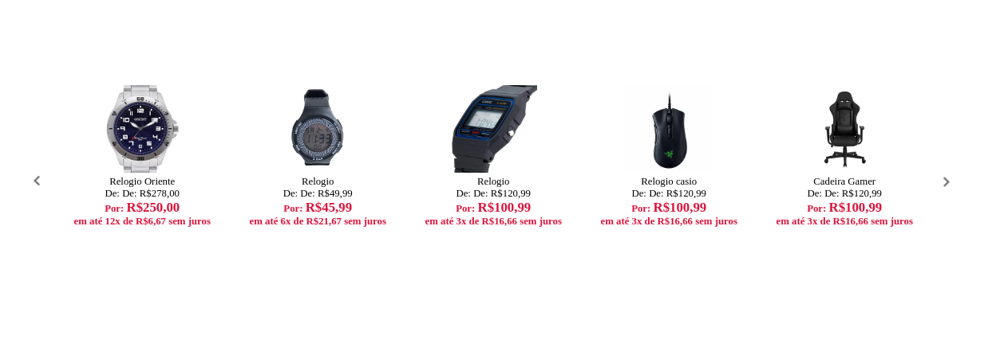

# Desafio de Estágio: Front-end

Neste desafio, você será responsável por construir uma vitrine em JavaScript puro, sem o uso de frameworks, que busca e exibe informações sobre um produto de referência e uma lista de produtos recomendados com paginação a partir de um serviço remoto.

## Instruções

Siga as etapas abaixo para concluir o desafio:

1. **Instalação do Módulo 'serve'**:
   - Utilize o gerenciador de pacotes npm para instalar o módulo 'serve' globalmente em sua máquina com o seguinte comando:

     ```shell
     npm install serve -g
     ```

   Isso permitirá que você inicie um servidor de desenvolvimento local para testar sua vitrine.

2. **Início do Projeto**:
   - Após a instalação bem-sucedida do módulo 'serve', inicie o projeto com o seguinte comando:

     ```shell
     npm start
     ```

   Isso iniciará um servidor de desenvolvimento local para que você possa visualizar e testar sua vitrine no navegador.

## Vitrine Renderizada

A sua vitrine deve se assemelhar ao exemplo abaixo:


